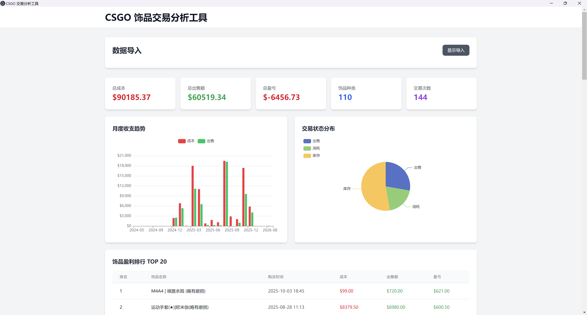

# CSGO 饰品交易分析工具

基于 Electron + Vue 3 + Vite + Tailwind 构建的 CSGO 饰品交易记录分析桌面应用。


## 功能特性

- CSV 和 Excel 文件导入（支持 .csv/.xlsx/.xls）
- 数据自动清洗与格式转换
- 交易统计（总成本、总出售额、盈亏分析）
- 月度收支趋势图表（ECharts）
- 交易状态分布饼图（出售/消耗/库存）
- 饰品盈利排行榜 TOP 20（单笔交易独立显示）
- 饰品亏损排行榜 TOP 20（单笔交易独立显示）
- 当前库存排名 TOP 20（按总成本排序）
- LokiJS 内存数据库 + 自动持久化
- 简洁 UI（无菜单栏，无自动调试控制台）

## 技术栈

- **前端**: Vue 3 + Vite + Tailwind CSS
- **桌面**: Electron
- **数据库**: LokiJS（内存数据库 + 自动持久化，纯 JavaScript，零编译）
- **图表**: ECharts
- **文件解析**: PapaParse (CSV) + SheetJS/xlsx (Excel)

## 安装依赖

```bash
npm install
```

**优势：**
- ✅ 纯 JavaScript 实现，无需任何编译环境
- ✅ 跨平台开箱即用（Windows/macOS/Linux）
- ✅ 安装速度极快（无 Native 模块编译）
- ✅ 内存数据库，查询性能优秀
- ✅ 自动持久化到磁盘，数据安全

## 使用说明

### 开发运行

```bash
# 同时启动前端和 Electron
npm run app:dev
```

**注意：**
- 开发时不会自动打开调试控制台，按 `Ctrl+Shift+I` 手动打开
- 应用无菜单栏，使用窗口标题栏的关闭按钮退出

### 打包构建

#### 本地打包

```bash
# 一键打包（包含前端构建 + Electron 打包）
npm run app:build
```

打包后的安装程序：`dist-electron/CSGO交易分析-1.0.0-Setup.exe`

#### GitHub Actions 自动发布（多平台）

本项目已配置 GitHub Actions，支持自动打包 Windows、macOS、Linux 三个平台的安装包。

**触发方式：**
```bash
# 方式 1：创建并推送 tag
git tag v1.0.0
git push origin v1.0.0

# 方式 2：使用 npm version（会自动创建 tag）
npm version patch  # 1.0.0 -> 1.0.1
git push --follow-tags
```

**打包产物：**
- **Windows**: `CSGO交易分析-1.0.0-Setup.exe` (NSIS 安装包)
- **macOS**:
  - `CSGO交易分析-1.0.0-x64.dmg` (Intel 芯片)
  - `CSGO交易分析-1.0.0-arm64.dmg` (Apple Silicon)
- **Linux**:
  - `CSGO交易分析-1.0.0-x64.AppImage` (通用格式)
  - `CSGO交易分析-1.0.0-x64.deb` (Debian/Ubuntu)

所有安装包会自动上传到 GitHub Releases 页面。

**注意事项：**
- 需要在 GitHub 仓库的 Settings → Actions → General 中启用 "Read and write permissions"
- macOS 代码签名需要 Apple Developer 证书（可选，未配置时使用默认签名）
- 首次打包约需 10-15 分钟（三个平台并行构建）

**安装程序特性：**
- 64位 Windows 安装包（NSIS）
- 可选择安装路径
- 自动创建桌面快捷方式
- 自动创建开始菜单快捷方式
- 安装包大小：约 150-200MB（包含 Chromium 和 Node.js 运行时）

## 数据排名说明

### 盈利/亏损排行
- **单笔交易独立显示**，不按道具名称聚合
- 只显示已完成的交易（状态为"出售"或"消耗"）
- 同名道具的不同交易会分别显示

**示例：**
```
盈利排行：
1. AK-47 | 红线 [2024-01-15] - 成本$125.50, 出售$135.00, 盈利+$9.50

亏损排行：
1. M4A1 消音型 [2024-02-05] - 成本$3520, 出售$3379.50, 亏损-$140.50
2. M4A1 消音型 [2024-03-10] - 成本$3000, 消耗, 亏损-$3000
```

### 库存排行
- 按道具名称聚合显示
- 只显示状态为"库存"的道具
- 按总成本降序排序（成本最高的在前）
- 显示：道具名称、总成本、数量

## 文件格式要求

### 支持的文件类型
- ✅ CSV 文件 (`.csv`)
- ✅ Excel 文件 (`.xlsx`, `.xls`)

### 数据列名要求

支持以下列名（不区分大小写）：

| 中文列名 | 英文列名 | 说明 |
|---------|---------|------|
| 购买时间 | Date / Time | 交易时间，支持 Excel 序列号或 YYYY.MM.DDHH:mm:ss 格式 |
| 道具名称 | Item Name | 饰品完整名称 |
| 金额 | Price / Cost | 购买成本金额 |
| 状态 | Status / Type | 出售、消耗 或留空（库存） |
| 出售时间 | Sell Date | 出售时间（可选） |
| 出售金额 | Sell Amount / Sell Price | 出售金额（仅在状态为"出售"时有效） |

### 业务逻辑说明

- **出售**：已卖出的道具
  - 盈亏 = 出售金额 - 成本
  - 计入总盈亏统计

- **消耗**：已在游戏中使用的道具
  - 盈亏 = -成本（全部亏损）
  - 计入总盈亏统计

- **库存**（状态为空）：已购买但未出售的道具
  - 盈亏 = 0
  - **不计入**总盈亏统计
  - 显示在"当前库存"排名中

### 示例 Excel

| 购买时间 | 道具名称 | 金额 | 状态 | 出售时间 | 出售金额 |
|---------|---------|------|------|---------|---------|
| 2024.01.1514:30:00 | AK-47 \| 红线 (久经沙场) | 125.50 | 出售 | 2024.01.1618:20:00 | 135.00 |
| 2024.02.0510:15:00 | M4A1 消音型 \| 渐变之色 | 3520.00 | 消耗 | | |
| 2024.03.2022:45:00 | AWP \| 二西莫夫 | 2800.00 | | | |

**说明：**
- 第一行：盈利 $9.50（出售）
- 第二行：亏损 -$3520（消耗）
- 第三行：库存中，不计盈亏

**注意：** Excel 文件默认读取第一个工作表（Sheet）。

## 数据存储

LokiJS 数据库文件位于用户数据目录：
- Windows: `%APPDATA%/csgo-trade-analyzer/transactions.db`
- macOS: `~/Library/Application Support/csgo-trade-analyzer/transactions.db`
- Linux: `~/.config/csgo-trade-analyzer/transactions.db`

**工作原理：**
- 数据加载到内存，查询速度快
- 每 4 秒自动保存到磁盘（可配置）
- 应用关闭时自动保存

## 项目结构

```
csgo/
├── electron/
│   ├── main.js        # Electron 主进程
│   └── preload.js     # IPC 桥接
├── src/
│   ├── components/
│   │   ├── FileImport.vue   # 文件导入组件
│   │   └── Dashboard.vue    # 数据仪表盘
│   ├── App.vue        # 主布局
│   ├── main.js        # Vue 入口
│   └── style.css      # Tailwind 样式
├── index.html
├── package.json
├── vite.config.js
└── tailwind.config.js
```

## 安全性

- ✅ Context Isolation 已启用
- ✅ Node Integration 已禁用
- ✅ IPC 通道仅暴露必要接口
- ✅ 文件选择使用系统对话框

## License

MIT
